# 论文动机 / Motivation（中英对照）

> 统一论点：在面向 LLM 多智能体系统（以文档处理型 agent-network 为测试床）的可观测性数据上，我们采集了指标(metrics)、调用链(trace)、日志(log)三个维度，覆盖 1/3/5 并发用户与单/多副本两种部署（数据均取自 `data/thingo/normal`）。分析表明下述两个动机在所有配置下稳定成立，是系统可观测性的内在困境。
>
> *Unifying claim: On observability data (metrics, traces, logs) from an LLM multi-agent system across 1/3/5 users and single/multi-replica deployments, both motivations below hold under all configurations and are intrinsic observability difficulties.*

---

# 动机一：指标滞后性使异常时间窗口难以确定
# Motivation 1: Metric lag makes anomaly time windows hard to determine

**大纲**：指标滞后性（1）无论单副本还是多副本都非常明显；（2）在多种指标上具有差异；（3）在不同负载下也具有差异；（4）随调用链路增长而累积 —— 因而难以确定时间窗口。
*Outline: metric lag is (1) evident under both single- and multi-replica; (2) differs across metrics; (3) differs across loads; (4) accumulates as the call chain grows — hence the time window is hard to determine.*

## 1.1 无论单副本还是多副本，滞后都明显存在
## 1.1 Metric lag is evident under both single- and multi-replica

以请求速率(QPS)为驱动信号、与资源指标做互相关，CPU 的响应峰值在单副本与多副本部署下均滞后于负载，且多副本下相关性更强（5 用户多副本 r 高达 0.94）。唯一的例外——单副本 1 用户下的 −45s——其互相关曲线近乎水平、峰值不显著，是低负载稀疏数据的伪影；重新采集后即转为物理合理的 +5s。可见滞后是稳健现象，而在稀疏观测下，连滞后本身的估计都不稳定。

*Cross-correlating the request rate (QPS) with resource metrics, the CPU response peaks after the load under both single- and multi-replica deployments, with stronger correlation under multi-replica (r up to 0.94 at 5-user multi). The sole exception—−45 s at 1-user single—has a nearly flat cross-correlation curve with no significant peak and is an artifact of low-load sparse data; it becomes a physically reasonable +5 s upon re-collection. Metric lag is thus a robust phenomenon, while with sparse metrics even the metric lag estimate itself is unstable.*

**表 1　滞后：单副本 vs 多副本 / Table 1　Metric lag: single vs multi-replica**

| run | QPS→CPU 滞后 (r) | QPS→内存 滞后 (r) |
|---|---|---|
| 1-user 单 single | −45s (0.56, 曲线近水平) | −45s (0.21) |
| 1-user 多 multi | **+5s (0.79)** | −25s (0.43) |
| 5-user 单 single | +30s (0.81) | +35s (0.15) |
| 5-user 多 multi | +10s (**0.94**) | +60s (0.66) |

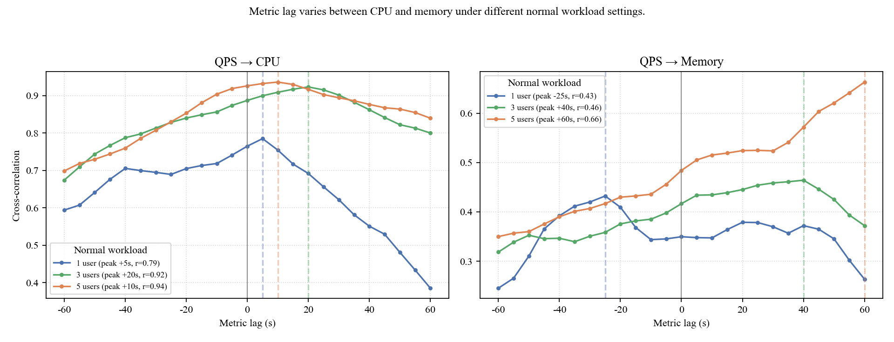

## 1.2 & 1.3 滞后在不同指标、不同负载下各不相同
## 1.2 & 1.3 The metric lag differs across metrics and across loads

滞后并非一个固定常数。同一负载下，CPU 与内存的最佳滞后明显不同（如 5 用户下 CPU +30s、内存 +35s 且相关很弱，多副本内存甚至达 +60s，体现内存缓慢累积、长时间不回落）；而同一指标在不同负载下的滞后也不同（CPU：1 用户偏噪声、3 用户 +55s、5 用户 +30s）。因此不存在单一时间偏移能同时对齐不同指标、不同负载的信号。

*The metric lag is not a fixed constant. Under the same load, CPU and memory peak at clearly different lags (e.g., at 5 users, CPU +30 s vs memory +35 s with weak correlation, and memory reaching +60 s under multi-replica, reflecting slow accumulation). The same metric also lags differently across loads (CPU: noisy at 1 user, +55 s at 3 users, +30 s at 5 users). Hence no single temporal offset can align signals across different metrics and loads.*

**表 2　各负载/各指标的峰值滞后（1/3/5 单副本）/ Table 2　Peak metric lag by load and metric (1/3/5 single-replica)**

| 负载 Load | QPS→CPU 滞后 (r) | QPS→内存 滞后 (r) |
|---|---|---|
| 1 user | −45s (0.56) † | −45s (0.21) |
| 3 users | +55s (0.72) | +40s (0.30) |
| 5 users | +30s (0.81) | +35s (0.15) |

† 1-user 单副本 −45s 为稀疏伪影（见 1.1）。/ *artifact, see 1.1.*

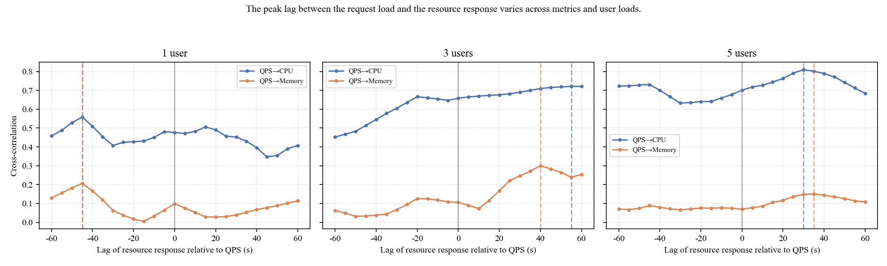

## 1.4 完成时间随调用链长度/深度累积
## 1.4 Completion time accumulates with chain length/depth

调用链并非固定的流水线：请求路径高度动态（长度 0–9 层、数十条不同路径），大多数工具智能体也不落在某个固定阶段上。但无论路径如何变化，从真实调用链的逐节点耗时看，**端到端完成时间随调用链长度增长而增大**（图 3，多副本：1 user 链长 3→约32s、5→约50s、7→约93s；3 users 链长 3→约28s、5→约62s、6→约76s；5 users 链长 3→约61s、长链(≥6) 约112–184s），**累计完成时间也随调用链深度逐跳累积、且跨请求离散度随深度变宽**（图 4）。因此一次逻辑请求的完成时刻既晚又高度不确定，"异常发生的时间窗口"因请求而异，无法用固定或等宽滑动窗口刻画。（本组图使用**多副本 1/3/5 users** 数据；10-user 因超出系统负载而数据失真，已弃用，改用有效的 3-user 负载。）

*The call chain is not a fixed pipeline: request paths are highly dynamic (length 0–9, dozens of distinct paths), and most tool agents do not sit at any fixed stage. Regardless of the path, from real per-node durations the end-to-end completion time grows with chain length (Fig. 3, multi-replica: 1 user, length 3 → ~32 s, 5 → ~50 s, 7 → ~93 s; 3 users, length 3 → ~28 s, 5 → ~62 s, 6 → ~76 s; 5 users, length 3 → ~61 s, long chains (≥6) → ~112–184 s), and the cumulative completion time also accumulates hop by hop with chain depth, with cross-request dispersion widening with depth (Fig. 4). A request's completion time is thus both late and highly uncertain; the anomaly's time window varies per request and cannot be captured by a fixed/equal-width sliding window. (These figures use multi-replica 1/3/5 user data; the 10-user runs overloaded the system and produced distorted data, so they are dropped in favour of the valid 3-user load.)*

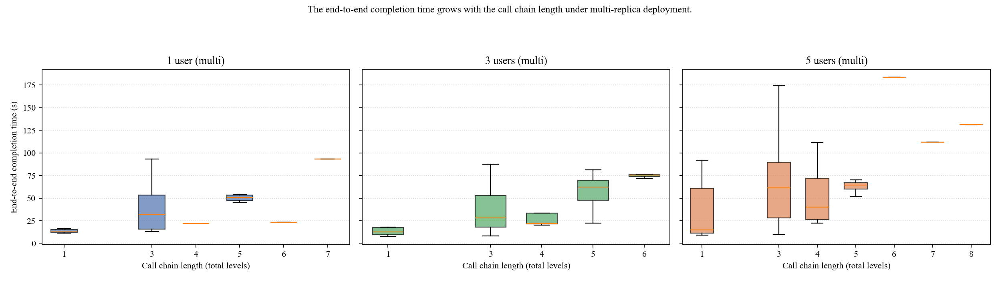

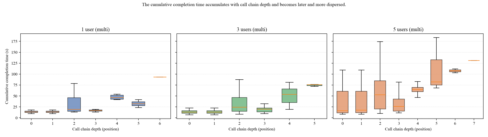

**表 3　调用链动态性 / Table 3　Call-chain dynamism**

| 负载 Load | 平均长度 mean len | 最长 max | 不同路径数 distinct paths | 路径熵 entropy (bit) |
|---|---|---|---|---|
| 1 user | 2.83 | 7 | 12 | 3.37 |
| 3 users | 2.63 | 6 | 16 | 3.70 |
| 5 users | 2.98 | 9 | 22 | 3.79 |

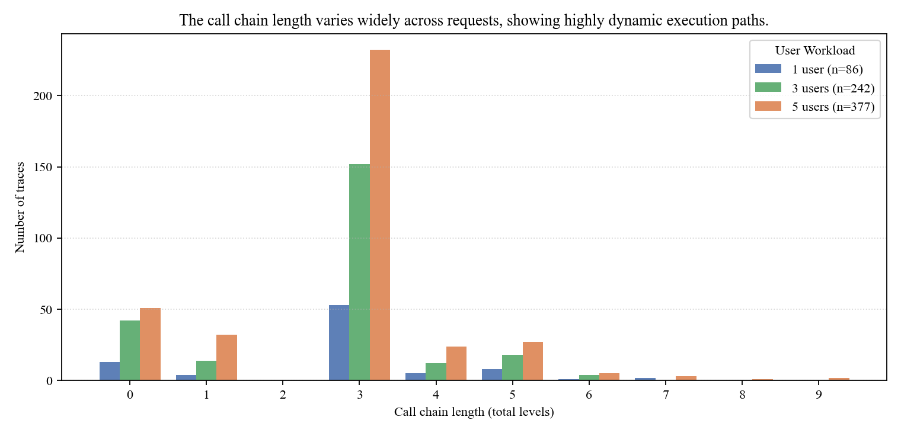

**► 结论 / Conclusion**：滞后稳健存在（跨副本）、随指标/负载而异；且无论调用链路径如何动态变化，完成时间都随链路长度/深度累积、越深越晚越分散。三者叠加使**异常时间窗口难以确定**；需要链路感知、随请求自适应的时间建模，以真实调用链时序为对齐锚点。
*Metric lag is robust (across replicas), varies by metric/load; and regardless of the dynamic path, completion time accumulates with chain length/depth (deeper = later & more dispersed). Together this makes anomaly time windows hard to determine, calling for chain-aware, per-request adaptive temporal modeling anchored on real call-chain timing.*

---

# 动机二：指标稀疏性大、方差大、动态性强，使故障特征难以捕捉
# Motivation 2: Sparse, high-variance, and dynamic metrics make failure features hard to capture

**大纲**：（1）指标有效信息比例少；（2）服务间差异大；（3）正常情况下稳定性弱（方差大）；（4）随调用链路变化而变化；（5）异常指标的表现与正常特征相似（故障数据验证）—— 因而难以捕捉异常指标特征。
*Outline: (1) low informative fraction; (2) large inter-service heterogeneity; (3) weak stability under normal workload (high variance); (4) varies with the call chain; (5) anomalous metrics resemble normal ones (validated on failure data) — hence failure features are hard to capture.*

## 2.1 指标有效信息比例少（稀疏性大）
## 2.1 Low informative fraction (high sparsity)

服务级指标极度稀疏。即使在 5 用户负载下，服务时延约 79% 为空、QPS 约 79% 为零，真正携带信息的单元格不足四分之一；trace 维度在多次采集中甚至整体为空。从真实调用链看，入口 planner 出现在约 86% 的请求中，而其余工具智能体的出现率普遍低于 25%——大多数服务只在少量请求里被触发。故障若发生在这些低频服务上，其信号极易被大面积缺失淹没。

*Service-level metrics are extremely sparse. Even at 5 users, ~79% of latency cells are empty and ~79% of QPS are zero, so fewer than a quarter of cells are informative; the trace modality was even entirely empty across several collections. From real call chains, the entry planner appears in ~86% of requests while all tool agents appear in under 25%. A failure on these low-frequency services is easily buried by widespread missingness.*

**表 4　指标有效信息占比 / Table 4　Fraction of informative cells** (%)

| 指标 metric | 1 user | 3 users | 5 users |
|---|---|---|---|
| latency 有效% | 9.9 | 14.2 | 20.6 |
| success_rate 有效% | 19.5 | 24.2 | 36.6 |
| qps 非零% | 9.8 | 14.4 | 21.2 |

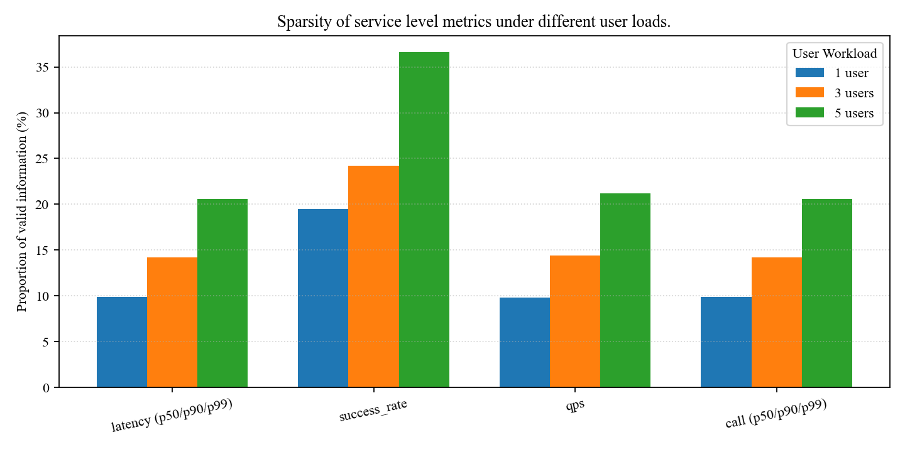

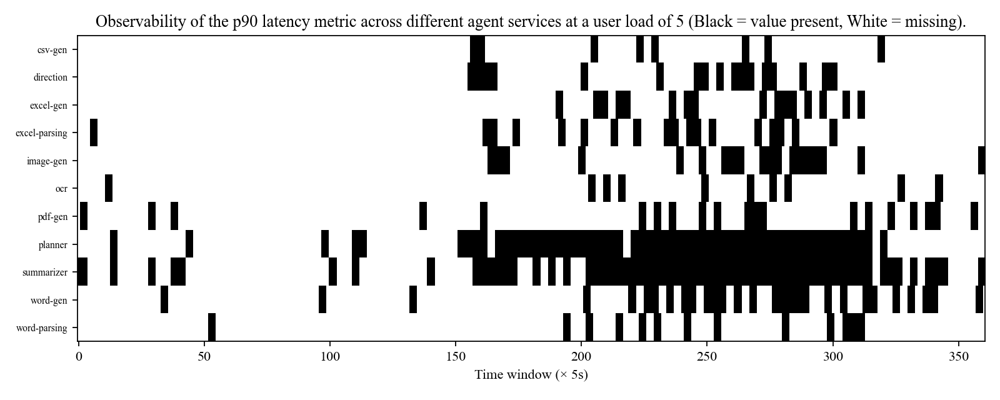

## 2.2 服务间差异大（异质性强）
## 2.2 Large inter-service heterogeneity

各服务在正常态的指标量级相差悬殊：5 用户下，CPU 均值跨服务相差约 3×、执行时间中位相差约 55×、内存约 3×；而且不同指标下的服务排序并不一致（planner 的 CPU 最高，pdf-gen 的执行时间最长）。调用频次同样悬殊（planner ≈86% vs 多数工具 <25%）。这意味着不存在统一的量纲/阈值/基线能同时适配所有服务，跨服务对齐与建模本身就困难。

*Services differ enormously in metrics under normal workload: at 5 users, mean CPU spans ~3×, median exec-time ~55×, memory ~3× across services, and the ranking differs per metric (planner tops CPU, pdf-gen tops exec-time). Invocation frequency is equally skewed (planner ~86% vs most tools <25%). No single scale/threshold/baseline fits all services, making cross-service alignment and modeling inherently hard.*

**表 5　服务间异质性（5 users）/ Table 5　Inter-service heterogeneity**

| 服务 service | CPU 均值 | 内存 MB | 执行时间中位 exec-med (s) | 覆盖率 coverage |
|---|---|---|---|---|
| planner | 0.075 | 949 | 164.14 | 85.5% |
| pdf-gen | 0.043 | 1411 | 148.14 | 11.6% |
| word-gen | 0.037 | 632 | 86.68 | 24.3% |
| ocr | 0.030 | 607 | 8.48 | 6.9% |
| csv-gen | 0.028 | 533 | 2.99 | 5.2% |
| 跨服务 max/min | ≈3× | ≈3× | ≈55× | — |

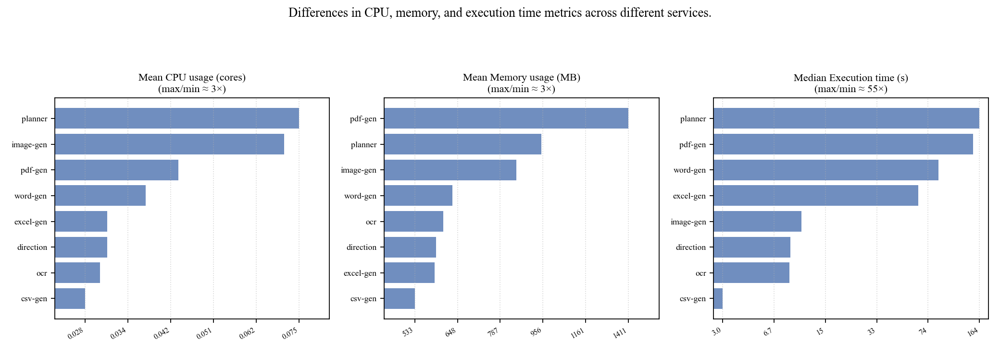

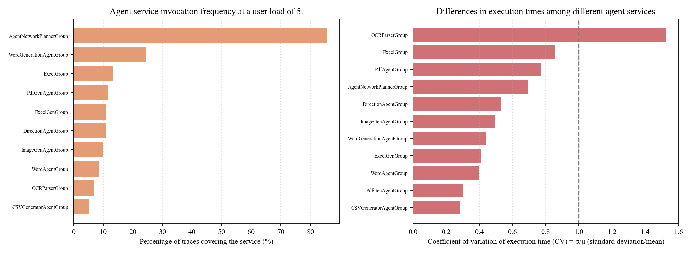

## 2.3 正常情况下稳定性弱（方差极大）
## 2.3 Weak stability under normal workload (extreme variance)

在指标确有取值处，其正常态方差很大。以变异系数(CV=σ/μ)度量，指标侧网络/CPU/时延的 CV 尾部可达 ~1.3–1.5；而从真实执行时间看方差更甚——工具智能体执行时间的中位 CV≈0.5、OCR≈2.8、planner≈0.7（σ 远超 μ）。也就是说，主导端到端时延的关键服务其正常波动本身就很大。在这种基线方差下，基于均值±kσ 的阈值要么过松漏报、要么频繁误报。

*Where metrics are available, their variance under normal workload is large. By CV = σ/μ, metric-side network/CPU/latency CV reaches ~1.3–1.5 in the tail; the real execution time varies even more — tool agents' exec-time CV has a median ≈0.5, OCR ≈2.8, planner ≈0.7 (σ far exceeding μ). The key services dominating end-to-end latency fluctuate greatly even normally; under such baseline variance, mean ± kσ thresholds either miss detections or raise frequent false alarms.*

**表 6　正常态指标变异系数（5 users）/ Table 6　Metrics CV under normal workload (5 users)**

| 指标 metric | 中位 median | p90 | 最大 max | CV>0.5 占比 |
|---|---|---|---|---|
| Memory | 0.04 | 0.17 | 0.19 | 0.00 |
| CPU | 0.25 | 1.02 | 1.53 | 0.31 |
| Net recv | 0.35 | 0.78 | 1.32 | 0.15 |
| Latency p99 | 0.45 | 0.93 | 1.05 | 0.45 |

（内存稳定可作对照；网络/时延/CPU 尾部方差大——可用于判异常的稳定指标本就少。/ *Memory is stable as a contrast; network/latency/CPU have large tail variance—few stable metrics are usable for anomaly discrimination.*）

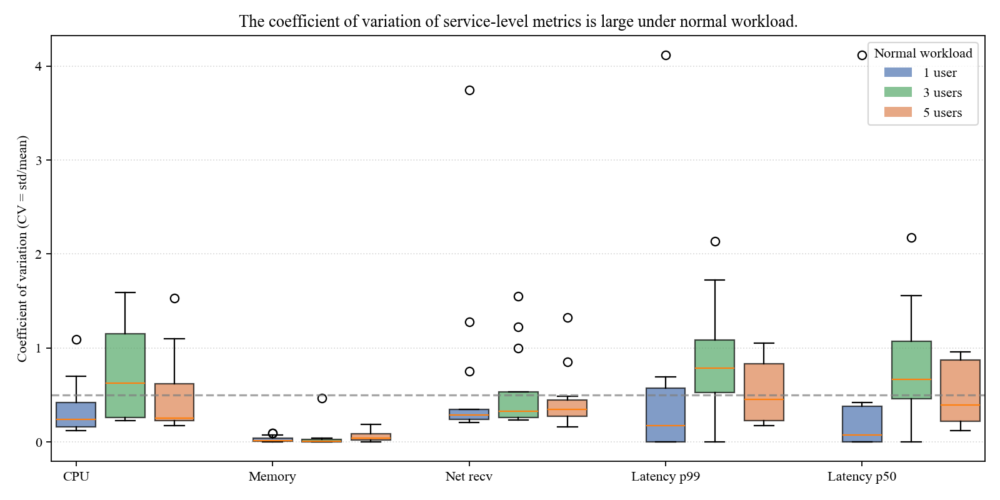

## 2.4 随调用链路变化而变化（动态性强）
## 2.4 Varies with the call chain (strong dynamism)

指标特征并非静态：调用链本身高度动态（长度 0–9、数十条不同路径），使得"哪些服务活跃、活跃多久"逐请求变化；即使同为正常态、同一负载，不同采集之间各服务的指标可观测性也大幅摆动（如 word-gen 时延可观测比例在两次采集间从 6.6% 变到 55.8%、OCR 从 59.1% 变到 1.7%），这源于任务组合差异而非部署变化。指标特征随调用路径与任务而漂移，进一步增加了刻画"正常"基线的难度。

*Metric features are not static: the highly dynamic chain (length 0–9, dozens of paths) makes "which services are active and for how long" vary per request; even within normal state at the same load, per-service observability swings greatly between collections (e.g., word-gen latency availability shifts 6.6%→55.8%, OCR 59.1%→1.7% across two collections), driven by task-mix differences rather than deployment changes. Features drift with the call path and task, further complicating any "normal" baseline.*

## 2.5 聚合指标被量化且冗余，判别力弱
## 2.5 Aggregated metrics are quantized and redundant, with weak discriminability

即便退一步依赖聚合时延，其信息质量也不足：服务级 latency 经直方图分桶后每服务仅剩 2–14 个离散取值（入口 planner 约 14 个），且 call.csv 与 latency.csv 逐值相同（无互补信息）；与真实完成时间相比，指标 p99 与真实值无规律偏差，倍率在 0.4×（低估）到 516×（高估，word-parsing）之间随服务乱跳。这样的特征既稀疏、又高噪、还被量化压缩，判别力薄弱。

*Even relying on aggregated latency, its information quality is insufficient: service-level latency collapses to only 2–14 discrete bucket values per service (up to ~14 for the entry planner), and call.csv equals latency.csv value-for-value (no complementary information); versus real completion time, the metric p99 deviates erratically from the real p99, with a ratio that jumps across services from 0.4× (under-) to 516× (over-estimate, word-parsing). Such features are simultaneously sparse, noisy, and quantization-compressed, hence weak in discriminability.*

**表 7　真实完成时间 vs 指标时延（5 users, 摘选）/ Table 7　Real completion time vs metric latency (5 users, excerpt)**

| 服务 service | 真实中位 (s) | 真实 p99 (s) | 真实 CV | 指标去重值数 #vals | 指标 p99 中位 (s) | p99 倍率 ratio |
|---|---|---|---|---|---|---|
| planner | 164.14 | 744.7 | 0.70 | 14 | 297.6 | 0.4× |
| ocr | 8.48 | 497.6 | 2.81 | 2 | 297.6 | 0.6× |
| word-parsing | 0.06 | 0.12 | 0.32 | 3 | 59.7 | 516× |

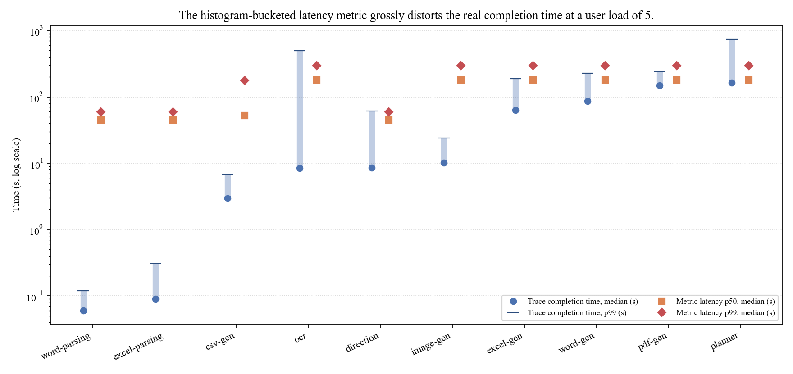

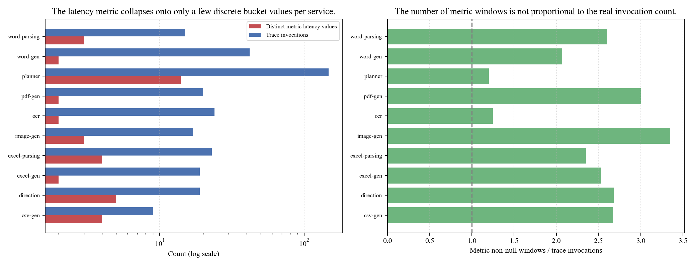

## 2.6 异常指标与正常波动重叠，且症状时间错位（故障数据验证）
## 2.6 Metrics overlap and metric lag during failure injection

> 本节按新异常数据重新核对；论文最终动机编号以 `motivation.tex` 为准（稀疏/异质指标为动机 1，时间窗口为动机 2）。完整口径、样本量与证据边界见 [异常补充报告](tables/summary_abnormal.md)。

在 PDF-parsing 服务上注入 CPU stress、memory stress、network latency、pod failure 和 pod kill，五类各一次，均为 3 用户、181 秒。主对照沿用 `common.DATASETS["3 users"]` 的正常数据；资源按服务汇总全部 Pod，包含 pod_kill 的替换 Pod。正常完整序列与标签故障区间作描述性比较。

**(1) 部分故障指标与正常波动重叠。** 正常 CPU CV 为 1.69，故障期为 0.46–3.36。网络延迟故障的 CPU、内存样本全部落入同负载正常 p10–p90 范围；pod_kill 的 CPU 有 56.8% 落入该范围。CPU stress 的 CPU、pod failure 的资源下降和 network latency 的 p99 则有较明显变化，不能把结论扩大为所有指标均不可分。CPU / 内存压力期间，故障服务的 p99 和成功率均缺失。

*CPU CV under normal workload is 1.69, compared with 0.46–3.36 across the five failure experiments. All CPU and memory metrics during network latency fall within the matched p10–p90 range under normal workload. Separation nevertheless depends on the metric and failure type, and p99 latency and success-rate metrics are missing during CPU and memory stress. These metrics provide no consistent temporal boundary for determining failure onset.*

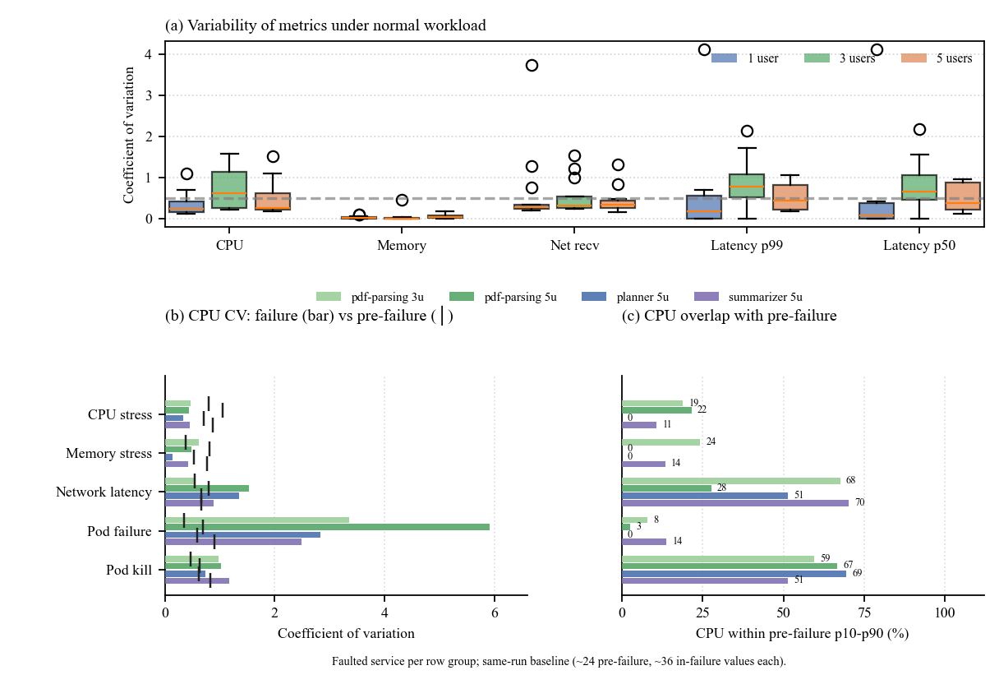

**(2) 故障服务与其他链路服务的信号位置和时间均不一致。** 所有有效的故障服务成功率观测都是 1.0，但 CPU / 内存压力期间没有有效值，不能声称全程成功。CPU stress 中，故障期 CPU 峰值为 568 mC，而入口 planner 和下游 summarizer 到故障开始后 400 秒（结束后 219 秒）才出现成功率下降。其他故障的时间偏移见下表。

| 故障 | 故障期自身成功率有效点 / 总点数 | 其他链路服务首次下降相对故障开始 | 相对故障结束 | 解读 |
|---|---:|---:|---:|---|
| CPU stress | 0 / 37 | +400 s | +219 s | 结束后首次下降 |
| Memory stress | 0 / 37 | +610 s | +429 s | 结束后首次下降 |
| Network latency | 32 / 37 | −75 s | −256 s | 注入前已有下降；注入后首次在 +120 s |
| Pod failure | 18 / 37 | +435 s | +254 s | 结束后首次下降 |
| Pod kill | 17 / 37 | +375 s | +194 s | 结束后首次下降 |

*Available success-rate metrics of the service with failure remain 1.0, but none are available during CPU or memory stress. In four experiments, the first reductions at the entry planner or downstream summarizer appear 194–429 s after failure injection ends. Network latency contains pre-injection degradation and is excluded from that range. This aggregate metric lag demonstrates temporal ambiguity; it does not establish causal propagation delays for individual requests.*

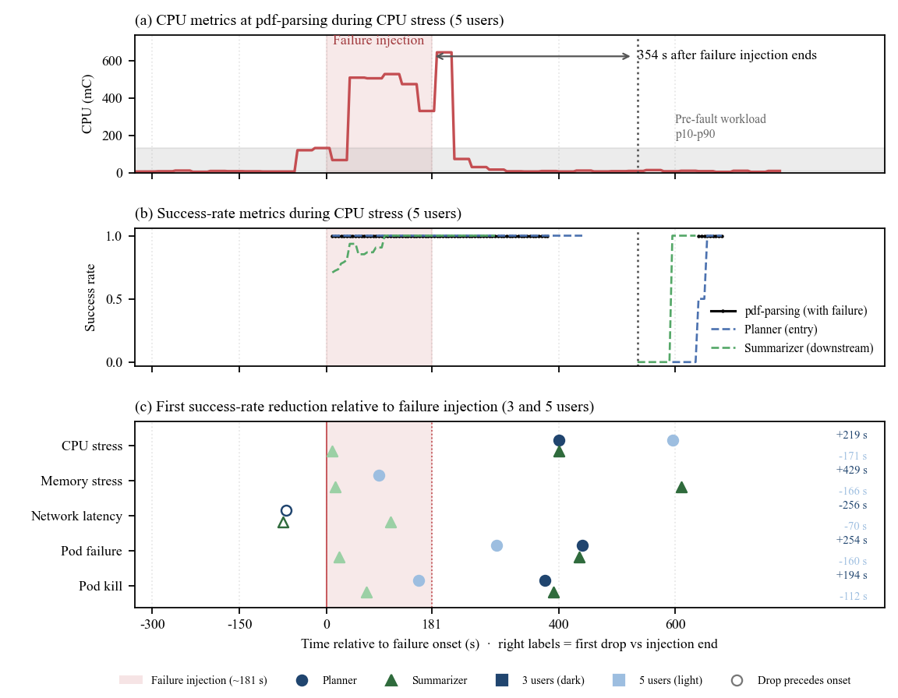

**结论：** 正常与异常指标的部分重叠使局部起点难以辨认，链路其他服务的症状又可能滞后或在注入前已经存在。因此，异常窗口应结合实际请求执行时序确定；这些数据不支持使用统一偏移回推故障起点。该结论不等于已经验证某个检测器会漏检，也不等于任意长度的回溯窗口都会失败。

*Overlap obscures local onset, while delayed or pre-existing symptoms elsewhere in the chain provide an uncertain temporal reference. Anomaly time windows therefore need to account for request-specific execution timing.*

---

### 图表来源 / Provenance
图位于 `analysis/figures/`，表位于 `analysis/tables/`（详见 `analysis/分析汇总.md`）。图 3、图 4、图 5 使用多副本 1/3/5 users 数据（10-user 因超负载失真已弃用）。
- 动机一 M1：图1 `recheck_lag_ccf.png`、图2 `c1_lag_ccf.png`、图3 `c1_completion_by_length.png`、图4 `c1r_completion_by_depth.png`、图5 `c1r_chain_dynamism.png`；表1 recheck 滞后、表2 `lag_peaks.csv`、表3 `chain_dynamism.csv`（另有 `chain_completion_by_length.csv`、`chain_completion_by_depth.csv`）
- 动机二 M2：图6 `c2_sparsity_bars.png`、图7 `c2_latency_availability.png`、图8 `c2b_service_heterogeneity.png`、图9 `c2r_vertex_sparsity_variance.png`、图10 `c2_variance_cv_box.png`、图11 `c1r_chain_dynamism.png`、图12 `joint_real_vs_metric_latency.png`、图13 `joint_quantization_coverage.png`；表4 `sparsity.csv`、表5 `service_heterogeneity.csv`+`chain_vertex_stats.csv`、表6 `variance_cv.csv`、表7 `joint_latency_completion.csv`
- 2.6 异常对比：`c2c_abn_vs_normal_overlap.csv`、`c2c_abn_baseline_sensitivity.csv`、`c1_abn_downstream_lag.csv`、`c1_abn_service_drop_times.csv`；口径见 `tables/summary_abnormal.md`。旧 `c2_abn_vs_normal.csv` 为历史口径，不用于当前正文。
